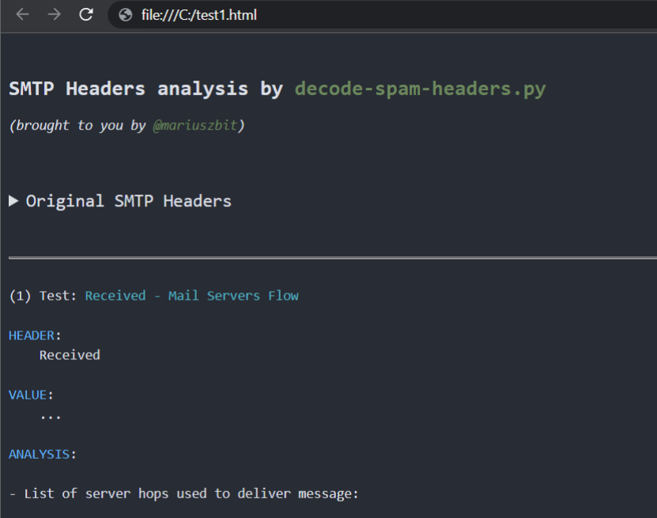

# decode-spam-headers.py

Whether you are trying to understand why a specific e-mail ended up in SPAM/Junk for your daily Administrative duties or for your Red-Team Phishing simulation purposes, this script is there for you to help!

Idea arose while delivering a commercial Phishing Simulation exercises against MS Office365 E5 estate, equipped with MS Defender for Office365. As one can imagine, pretty tough security stack to work with from a phishing-simulation perspective.
After digging manually through all these Office365 SMTP headers and trying to cherry-pick these SCL values, time come to write up a proper parser for SMTP headers.

Time went by, I was adding support for more and more SMTP headers - and here we have it. Tool that now comprehends tens of different headers.

## Info

This tool accepts on input an `*.EML` or `*.txt` file with all the SMTP headers. It will then extract a subset of interesting headers and using **105+** tests will attempt to decode them as much as possible.

This script also extracts all IPv4 addresses and domain names and performs full DNS resolution of them.

Resulting output will contain useful information on why this e-mail might have been blocked.

In order to embellish your Phishing HTML code before sending it to your client, you might also want feed it into my [`phishing-HTML-linter.py`](https://github.com/mgeeky/Penetration-Testing-Tools/blob/master/phishing/phishing-HTML-linter.py). It does pretty decent job finding _bad smells_ in your HTML that will get your e-mail with increased Spam-score.


### Example Screenshots

- Chain of MTA servers (nicely parsed `Received` headers):


- Various headers decoded as much as possible, according to publicly available documentation (here _Office365 ForeFront Spam Report_):


- Different custom heuristics implement to actively validate and seek for clues of spam categorization, here logic detecting _Domain Impersonation_:


- Script attempts to reverse-engineer and document some of the Office365 Anti-Spam rules, as well as collect public knowledge about other opaque Anti-Spam headers:


- Report can be generated into a good-looking HTML (usage: `py decode-spam-headers.py headers.txt -f html -o report.html` ):




### Processed headers

Processed headers (more than **85+** headers are parsed):

- `X-forefront-antispam-report`
- `X-exchange-antispam`
- `X-exchange-antispam-mailbox-delivery`
- `X-exchange-antispam-message-info`
- `X-microsoft-antispam-report-cfa-test`
- `Received`
- `From`
- `To`
- `Subject`
- `Thread-topic`
- `Received-spf`
- `X-mailer`
- `X-originating-ip`
- `User-agent`
- `X-forefront-antispam-report`
- `X-microsoft-antispam-mailbox-delivery`
- `X-microsoft-antispam`
- `X-exchange-antispam-report-cfa-test`
- `X-spam-status`
- `X-spam-level`
- `X-spam-flag`
- `X-spam-report`
- `X-vr-spamcause`
- `X-ovh-spam-reason`
- `X-vr-spamscore`
- `X-virus-scanned`
- `X-spam-checker-version`
- `X-ironport-av`
- `X-ironport-anti-spam-filtered`
- `X-ironport-anti-spam-result`
- `X-mimecast-spam-score`
- `Spamdiagnosticmetadata`
- `X-ms-exchange-atpmessageproperties`
- `X-msfbl`
- `X-ms-exchange-transport-endtoendlatency`
- `X-ms-oob-tlc-oobclassifiers`
- `X-ip-spam-verdict`
- `X-amp-result`
- `X-ironport-remoteip`
- `X-ironport-reputation`
- `X-sbrs`
- `X-ironport-sendergroup`
- `X-policy`
- `X-ironport-mailflowpolicy`
- `X-remote-ip`
- `X-sea-spam`
- `X-fireeye`
- `X-antiabuse`
- `X-tmase-version`
- `X-tm-as-product-ver`
- `X-tm-as-result`
- `X-imss-scan-details`
- `X-tm-as-user-approved-sender`
- `X-tm-as-user-blocked-sender`
- `X-tmase-result`
- `X-tmase-snap-result`
- `X-imss-dkim-white-list`
- `X-tm-as-result-xfilter`
- `X-tm-as-smtp`
- `X-scanned-by`
- `X-mimecast-spam-signature`
- `X-mimecast-bulk-signature`
- `X-sender-ip`
- `X-forefront-antispam-report-untrusted`
- `X-microsoft-antispam-untrusted`
- `X-sophos-senderhistory`
- `X-sophos-rescan`
- `X-MS-Exchange-CrossTenant-Id`
- `X-OriginatorOrg`
- `IronPort-Data`
- `IronPort-HdrOrdr`
- `X-DKIM`
- `DKIM-Filter`
- `X-SpamExperts-Class`
- `X-SpamExperts-Evidence`
- `X-Recommended-Action`
- `X-AppInfo`
- `X-Spam`
- `X-TM-AS-MatchedID`
- `X-MS-Exchange-EnableFirstContactSafetyTip`
- `X-MS-Exchange-Organization-BypassFocusedInbox`
- `X-MS-Exchange-SkipListedInternetSender`
- `X-MS-Exchange-ExternalOriginalInternetSender`
- `X-CNFS-Analysis`
- `X-Authenticated-Sender`
- `X-Apparently-From`
- `X-Env-Sender`
- `Sender`


Most of these headers are not fully documented, therefore the script is unable to pinpoint all the details, but at least it collects all I could find on them.


### Reverse-Engineering efforts

I'm making signifcant efforts to spot and understand different Office365 ForeFront Anti-Spam ruls (SFS, ENG) despite them not being publicly documented.

```
------------------------------------------
(5) Test: X-Forefront-Antispam-Report

HEADER:
    X-Forefront-Antispam-Report

VALUE:
    CIP:209.85.167.100;CTRY:US;LANG:de;SCL:5;SRV:;IPV:NLI;SFV:SPM;H:mail-lf1-f100.google.com;PTR:mail-l
    f1-f100.google.com;CAT:DIMP;SFTY:9.19;SFS:(4636009)(956004)(166002)(6916009)(356005)(336012)(19
    625305002)(22186003)(5660300002)(4744005)(6666004)(35100500006)(82960400001)(26005)(7596003)(7636003)(554460
    02)(224303003)(1096003)(58800400005)(86362001)(9686003)(43540500002);DIR:INB;SFTY:9.19;

[...]

        - Message matched 24 Anti-Spam rules (SFS):           <============ opaque anti-spam rules
                - (1096003)
                - (166002)
                - (19625305002)
                - (22186003)
                - (224303003)
                - (26005)
                - (336012)
                - (356005)
                - (35100500006)         - (SPAM) Message contained embedded image.

```


The process is purely manual and resorts to sending specifically designed mails to the Office365 mail servers and then manually reviewing and correlating collected rules.

Having sent more than 60 mails already, this is what I can tell by now about Microsoft's rules:

```py

    #
    # Below rules were collected solely in a trial-and-error manner or by scraping any 
    # pieces of information from all around the Internet.
    #
    # They do not represent the actual Anti-Spam rule name or context and surely represent 
    # something close to what is understood (or they may have totally different meaning).
    # 
    # Until we'll be able to review anti-spam rules documention, there is no viable mean to map
    # rule ID to its meaning.
    #

    Anti_Spam_Rules_ReverseEngineered = \
    {
        '35100500006' : logger.colored('(SPAM) Message contained embedded image.', 'red'),

        # https://docs.microsoft.com/en-us/answers/questions/416100/what-is-meanings-of-39x-microsoft-antispam-mailbox.html
        '520007050' : logger.colored('(SPAM) Moved message to Spam and created Email Rule to move messages from this particular sender to Junk.', 'red'),

        # triggered on an empty mail with subject being: "test123 - viagra"
        '162623004' : 'Subject line contained suspicious words (like Viagra).',

        # triggered on mail with subject "test123" and body being single word "viagra"
        '19618925003' : 'Mail body contained suspicious words (like Viagra).',

        # triggered on mail with empty body and subject "Click here"
        '28233001' : 'Subject line contained suspicious words luring action (ex. "Click here"). ',

        # triggered on a mail with test subject and 1500 words of http://nietzsche-ipsum.com/
        '30864003' : 'Mail body contained a lot of text (more than 10.000 characters).',

        # mails that had simple message such as "Hello world" triggered this rule, whereas mails with
        # more than 150 words did not.
        '564344004' : 'HTML mail body with less than 150 words of text (not sure how much less though)',

        # message was sent with a basic html and only one <u> tag in body.
        '67856001' : 'HTML mail body contained underline <u> tag.',

        # message with html,head,body and body containing simple text with no b/i/u formatting.
        '579124003' : 'HTML mail body contained text, but no text formatting (<b>, <i>, <u>) was present',

        # This is a strong signal. Mails without <a> doesnt have this rule.
        '166002' : 'HTML mail body contained URL <a> link.',

        # Message contained <a href="https://something.com/file.html?parameter=value" - GET parameter with value.
        '21615005' : 'Mail body contained <a> tag with URL containing GET parameter: ex. href="https://foo.bar/file?aaa=bbb"',

        # Message contained <a href="https://something.com/file.html?parameter=https://another.com/website" 
        # - GET parameter with value, being a URL to another website
        '45080400002' : 'Something about <a> tag\'s URL. Possibly it contained GET parameter with value of another URL: ex. href="https://foo.bar/file?aaa=https://baz.xyz/"',

        # Message contained <a> with href pointing to a file with dangerous extension, such as file.exe
        '460985005' : 'Mail body contained HTML <a> tag with href URL pointing to a file with dangerous extension (such as .exe)',

        #
        # Message1: GoPhish -> VPS 587/tcp redirector -> smtp.gmail.com:587 -> target
        # Message2: GoPhish -> VPS 587/tcp redirector -> smtp-relay.gmail.com:587 -> target
        #
        # These were the only differences I spotted:
        #   Message1 - FirstHop Gmail SMTP Received with ESMTPS.
        #   Message2 - FirstHop Gmail SMTP-Relay Received with ESMTPSA.
        #
        '121216002' : 'First Hop MTA SMTP Server used as a SMTP Relay. It\'s known to originate e-mails, but here it acted as a Relay. Or maybe due to use of "with ESMTPSA" instead of ESMTPS?',

        # Triggered on message with <a> added to HTML: <a href="https://support.spotify.com/is-en/">https://www.reddit.com/</a>
        '966005' : 'Mail body contained link tag with potentially masqueraded URL: <a href="https://attacker.com">https://example.com</a>',

        #
        # Message1: GoPhish EC2 -> another EC2 with socat to smtp.gmail.com:587 (authenticated) -> Target
        # Message2: GoPhish EC2 -> Gsuite -> Target
        #
        # Subject, mail body were exactly the same.
        #
        # Below two rules were added to the second message. My understanding is that they're somehow referring
        # to the reputation of the first-hop server, maybe reverse-DNS resolution.
        #
        '5002400100002' : "(GUESSING) Somehow related to First Hop server reputation, it's reverse-PTR resolution or domain impersonation",
        '58800400005'   : "(GUESSING) Somehow related to First Hop server reputation, it's reverse-PTR resolution or domain impersonation",

        '19625305002' : '(GUESSING) Something to do with the HTML code and used tags/structures',
        '43540500002' : '(GUESSING) Something to do with the HTML code and used tags/structures',

        '460985005' : '(GUESSING) Something to do with either more-complex HTML code or with the <a> tag and its URL.',

        # Triggered on an empty text message, subject "test" - that was marked with "Domain Impersonation", however 
        # ForeFront Anti-Spam headers did not support that Domain Impersonation. Weird.
        '22186003' : '(GUESSING) Something to do with either Text message (non-HTML) or probable Domain Impersonation',

        # Found by @ipSlav (https://github.com/mgeeky/decode-spam-headers/issues/15)
        '42882007' : 'Missing Reply-To Address. Might be fixed by adding -ReplyTo flag to Send-MailMessage',
        '78352004' : 'Missing Reply-To Address. Might be fixed by adding -ReplyTo flag to Send-MailMessage',
    }
```

Should you know anything about any other Office365 anti-spam rules (or have suggestions to the ones described above) - let me know in this repo's issues, I'll add it straight away :)


### Usage

Install required Python3 dependencies before first use:

```
bash$ pip3 install -r requirements.txt 
```

Help:

```
PS> py .\decode-spam-headers.py --help
usage: decode-spam-headers.py [options] <file | --list tests>

optional arguments:
  -h, --help            show this help message and exit

Required arguments:
  infile                Input file to be analysed or --list tests to show available tests.

Options:
  -o OUTFILE, --outfile OUTFILE
                        Output file with report
  -f {json,text,html}, --format {json,text,html}
                        Analysis report format. JSON, text. Default: text
  -N, --nocolor         Dont use colors in text output.
  -v, --verbose         Verbose mode.
  -d, --debug           Debug mode.
  -l, --list            List available tests and quit. Use it like so: --list tests

Tests:
  -i tests, --include-tests tests
                        Comma-separated list of test IDs to run. Ex. --include-tests 1,3,7
  -e tests, --exclude-tests tests
                        Comma-separated list of test IDs to skip. Ex. --exclude-tests 1,3,7
  -r, --resolve         Resolve IPv4 addresses / Domain names.
  -R, --dont-resolve    Do not resolve anything.
  -a, --decode-all      Decode all =?us-ascii?Q? mail encoded messages and print their contents.
```

If you want to run only a subset of tests, you'll first need to learn Test IDs of which to pick.
Run the script with `-l tests` to grab that list.

List available test and their corresponding IDs:

```
C:\> py decode-spam-headers.py -l tests

[.] Available tests:

        TEST_ID - TEST_NAME
        --------------------------------------
              1 - Received - Mail Servers Flow
              2 - Extracted IP addresses
              3 - Extracted Domains
              4 - Bad Keywords In Headers
              5 - Sender Address Analysis
              6 - Subject and Thread Topic Difference
              7 - Authentication-Results
              8 - ARC-Authentication-Results
              9 - Received-SPF
             10 - Mail Client Version
             11 - User-Agent Version
             12 - X-Forefront-Antispam-Report
             13 - X-MS-Exchange-Organization-SCL
             14 - X-Microsoft-Antispam-Mailbox-Delivery
             15 - X-Microsoft-Antispam Bulk Mail
             16 - X-Exchange-Antispam-Report-CFA-Test
             17 - Domain Impersonation
             18 - SpamAssassin Spam Status
             19 - SpamAssassin Spam Level
             20 - SpamAssassin Spam Flag
             21 - SpamAssassin Spam Report
             22 - OVH's X-VR-SPAMCAUSE
             23 - OVH's X-Ovh-Spam-Reason
             24 - OVH's X-Ovh-Spam-Score
             25 - X-Virus-Scan
             26 - X-Spam-Checker-Version
             27 - X-IronPort-AV
             28 - X-IronPort-Anti-Spam-Filtered
             29 - X-IronPort-Anti-Spam-Result
             30 - X-Mimecast-Spam-Score
             31 - Spam Diagnostics Metadata
             32 - MS Defender ATP Message Properties
             33 - Message Feedback Loop
             34 - End-to-End Latency - Message Delivery Time
             36 - X-IP-Spam-Verdict
             37 - X-Amp-Result
             38 - X-IronPort-RemoteIP
             39 - X-IronPort-Reputation
             40 - X-SBRS
             41 - X-IronPort-SenderGroup
             42 - X-Policy
             43 - X-IronPort-MailFlowPolicy
             44 - X-SEA-Spam
             45 - X-FireEye
             46 - X-AntiAbuse
             47 - X-TMASE-Version
             48 - X-TM-AS-Product-Ver
             49 - X-TM-AS-Result
             50 - X-IMSS-Scan-Details
             51 - X-TM-AS-User-Approved-Sender
             52 - X-TM-AS-User-Blocked-Sender
             53 - X-TMASE-Result
             54 - X-TMASE-SNAP-Result
             55 - X-IMSS-DKIM-White-List
             56 - X-TM-AS-Result-Xfilter
             57 - X-TM-AS-SMTP
             58 - X-TMASE-SNAP-Result
             59 - X-TM-Authentication-Results
             60 - X-Scanned-By
             61 - X-Mimecast-Spam-Signature
             62 - X-Mimecast-Bulk-Signature
             63 - X-Forefront-Antispam-Report-Untrusted
             64 - X-Microsoft-Antispam-Untrusted
             65 - X-Mimecast-Impersonation-Protect
             66 - X-Proofpoint-Spam-Details
             67 - X-Proofpoint-Virus-Version
             68 - SPFCheck
             69 - X-Barracuda-Spam-Score
             70 - X-Barracuda-Spam-Status
             71 - X-Barracuda-Spam-Report
             72 - X-Barracuda-Bayes
             73 - X-Barracuda-Start-Time
             74 - Similar to SpamAssassin Spam Level headers
             75 - SMTP Header Contained IP address
             76 - Other unrecognized Spam Related Headers
             77 - Other interesting headers
             78 - Security Appliances Spotted
             79 - Email Providers Infrastructure Clues
             80 - X-Microsoft-Antispam-Message-Info (use -a to show its results)
             81 - Decoded Mail-encoded header values (use -a to show its results)
             82 - Header Containing Client IP
             83 - Office365 Tenant ID
             84 - Organization Name
             85 - MS Defender for Office365 Safe Links Version
             86 - Suspicious Words in Headers
             87 - AWS SES Outgoing
             88 - IronPort-Data
             89 - IronPort-HdrOrder
             90 - X-DKIM
             91 - DKIM-Filter
             92 - X-SpamExperts-Class
             93 - X-SpamExperts-Evidence
             94 - X-Recommended-Action
             95 - X-AppInfo
             96 - X-Spam
             97 - X-TM-AS-MatchedID
             98 - MTA Hostname Exposed
             99 - Office365 First Contact Safety Tip
            100 - EOP - Bypass Focused Inbox
            101 - EOP - Enhanced Filtering - SkipListedInternetSender
            102 - EOP - Enhanced Filtering - ExternalOriginalInternetSender
            103 - Cloudmark Analysis
            104 - The Real Sender - via Authenticated-Sender
            105 - Identified Sender Addresses
            106 - Unsual SMTP headers
```


### HTML Report

In order to generate HTML report - use the following parameters:

```
  PS> py decode-spam-headers.py headers.txt -f html -o report.html
```


### Sample run

Sample run (output structure and contents come from an outdated version of the script):

```
  PS> py decode-spam-headers.py headers.txt

------------------------------------------
(1) Test: Received - Mail Servers Flow

HEADER:
    Received

VALUE:
    ...

ANALYSIS:
    - List of server hops used to deliver message:

          --> (1) "attacker" <attacker@attacker.com>

               |_> (2) SMTP-SERVICE (44.55.66.77)
                      time: 01 Jan 2021 12:34:20

                  |_> (3) mail-wr1-f51.google.com (209.85.221.51)
                          time: 01 Jan 2021 12:34:20
                          version: fuzzy match: Exchange Server 2019 CU11; October 12, 2021; 15.2.986.9

                      |_> (4) SN1NAM02FT0061.eop-nam02.prod.protection.outlook.com (2603:10b6:806:131:cafe::e5)
                              time: 01 Jan 2021 12:34:20
                              version: fuzzy match: Exchange Server 2019 CU11; October 12, 2021; 15.2.986.9

                          |_> (5) SA0PR11CA0138.namprd11.prod.outlook.com (2603:10b6:806:131::23)
                                  time: 01 Jan 2021 12:34:20
                                  version: fuzzy match: Exchange Server 2019 CU11; October 12, 2021; 15.2.986.9

                              |_> (6) CP2PR80MB4114.lamprd80.prod.outlook.com (2603:10d6:102:3c::15)
                                      time: 01 Jan 2021 12:34:23

                                  |_> (7) "Victim Surname" <victim@contoso.com>


------------------------------------------

[...]

------------------------------------------
(4) Test: Mail Client Version

HEADER:
    X-Mailer

VALUE:
    OEM

ANALYSIS:
    - X-Mailer header was present and contained value: "OEM".


------------------------------------------
(5) Test: X-Forefront-Antispam-Report

HEADER:
    X-Forefront-Antispam-Report

VALUE:
    CIP:209.85.167.100;CTRY:US;LANG:de;SCL:5;SRV:;IPV:NLI;SFV:SPM;H:mail-lf1-f100.google.com;PTR:mail-l
    f1-f100.google.com;CAT:DIMP;SFTY:9.19;SFS:(4636009)(956004)(166002)(6916009)(356005)(336012)(19
    625305002)(22186003)(5660300002)(4744005)(6666004)(35100500006)(82960400001)(26005)(7596003)(7636003)(554460
    02)(224303003)(1096003)(58800400005)(86362001)(9686003)(43540500002);DIR:INB;SFTY:9.19;

ANALYSIS:
    - Microsoft Office365/Exchange ForeFront Anti-Spam report

        - CIP: Connecting IP address: 209.85.167.100

        - CTRY: The source country as determined by the connecting IP address
                - US

        - LANG: The language in which the message was written
                - de

        - IPV: Ingress Peer Verification status
                - NLI: The IP address was not found on any IP reputation list.

        - SFV: Message Filtering
                - SPM: The message was marked as spam by spam filtering.

        - H: The HELO or EHLO string of the connecting email server.
                - mail-lf1-f100.google.com

        - PTR: Reverse DNS of the Connecting IP peer's address
                - mail-lf1-f100.google.com

        - CAT: The category of protection policy
                - DIMP: Domain Impersonation

        - SFTY: The message was identified as phishing
                - 9.19: Domain impersonation. The sending domain is attempting to impersonate a protected domain

        - DIR: Direction of email verification
                - INB: Inbound email verification

        - Message matched 24 Anti-Spam rules (SFS):
                - (1096003)
                - (166002)
                - (19625305002)
                - (22186003)
                - (224303003)
                - (26005)
                - (336012)
                - (356005)
                - (35100500006)         - (SPAM) Message contained embedded image.
                - (43540500002)
                - (4636009)
                - (4744005)
                - (55446002)
                - (5660300002)
                - (58800400005)
                - (6666004)
                - (6916009)
                - (7596003)
                - (7636003)
                - (82960400001)
                - (86362001)
                - (956004)
                - (9686003)

        - SCL: Spam Confidence Level: 5
                - SPAM: Spam filtering marked the message as Spam


More information:
        - https://docs.microsoft.com/en-us/microsoft-365/security/office-365-security/anti-spam-message-headers
        - https://docs.microsoft.com/en-us/exchange/antispam-and-antimalware/antispam-protection/antispam-stamps
        - https://docs.microsoft.com/en-us/microsoft-365/security/office-365-security/spam-confidence-levels
        - https://docs.microsoft.com/en-us/exchange/monitoring/trace-an-email-message/run-a-message-trace-and-view-results


------------------------------------------
(6) Test: X-Microsoft-Antispam-Mailbox-Delivery

HEADER:
    X-Microsoft-Antispam-Mailbox-Delivery

VALUE:
    ucf:0;jmr:1;auth:0;dest:J;ENG:(910001)(944506458)(944626604)(750132)(520011016);

ANALYSIS:
    - This header denotes what to do with received message, where to put it.

        - auth: Message originating from Authenticated sender
                - 0: Not Authenticated

        - dest: Destination where message should be placed
                - J: JUNK directory

        - Message matched 6 Anti-Spam Delivery rules:
                - (520011016)
                - (750132)
                - (910001)
                - (944506458)
                - (944626604)


------------------------------------------
(7) Test: X-Microsoft-Antispam Bulk Mail

HEADER:
    X-Microsoft-Antispam
VALUE:
    BCL:0;

ANALYSIS:
    - BCL: BULK Confidence Level: 0
        The message isn't from a bulk sender.

    More information:
                - https://docs.microsoft.com/en-us/microsoft-365/security/office-365-security/bulk-complaint-level-values

------------------------------------------

[...]

------------------------------------------
(10) Test: MS Defender ATP Message Properties

HEADER:
    X-MS-Exchange-AtpMessageProperties

VALUE:
    SA|SL

ANALYSIS:
    - MS Defender Advanced Threat Protection enabled following protections on this message:
        - Safe Attachments Protection
        - Safe Links Protection


------------------------------------------
(11) Test: Domain Impersonation

HEADER:
    From

VALUE:
    "attacker" <attacker@attacker.com>

ANALYSIS:
    - Mail From: <attacker@attacker.com>

                - Mail Domain: attacker.com
                       --> resolves to: 11.22.33.44
                           --> reverse-DNS resolves to: ec2-11-22-33-44.eu-west-3.compute.amazonaws.com
                               (sender's domain: amazonaws.com)

                - First Hop:   SMTP-SERVICE (44.55.66.77)
                       --> resolves to:
                           --> reverse-DNS resolves to: host44-55-66-77.static.arubacloud.pl
                               (first hop's domain: arubacloud.pl)

        - Domain SPF: "v=spf1 include:_spf.google.com ~all"

        - WARNING! Potential Domain Impersonation!
                - Mail's domain should resolve to:      amazonaws.com
                - But instead first hop resolved to:    arubacloud.pl
```

---

### Credits

- [ipSlav](https://github.com/ipSlav) - for [identifying two Office365 opaque rules](https://github.com/mgeeky/decode-spam-headers/issues/15): `42882007` and `78352004`


---

### Known Issues

- `getOffice365TenantNameById(tenantID)` method is not yet finished, I know of a few ways to map Office365 Tenant GUID into Tenant Name but couldn't yet establish a stable way to do so.
- `Authentication-Results` header is not yet completely parsed - gotta include `reason` processing and other fields according to [Microsoft documentation](https://docs.microsoft.com/en-us/microsoft-365/security/office-365-security/anti-spam-message-headers?view=o365-worldwide)

---

### ☕ Show Support ☕

This and other projects are outcome of sleepless nights and **plenty of hard work**. If you like what I do and appreciate that I always give back to the community,
[Consider buying me a coffee](https://github.com/sponsors/mgeeky) _(or better a beer)_ just to say thank you! 💪 

---

```
Mariusz Banach / mgeeky, (@mariuszbit)
<mb [at] binary-offensive.com>
```